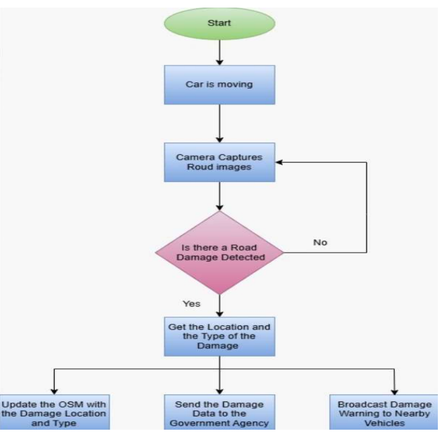

# ADVANCED ROAD SAFETY SYSTEM BASED ON V2V AND V2C

This repository contains all the necessary knowledge to build our graduation project on Embedded Linux. The project is organized into three main folders: vehicle to vehicle communication, vehicle to cloud communication, and openstreetmap.

## Software Development Life Cycle (SDLC)

### 🔁 1. Requirements Analysis

Goal: Detect road damages and send alerts to nearby cars, the cloud (government), and visualize on a map.

Stakeholders: Smart car users, non-smart car users ,government agencies.

#### Functional Requirements:

Detect potholes, cracks, faded road markings, and other road objects using YOLOv12.

Send alerts to:

Other vehicles (V2V via ESP-NOW).

AWS Cloud (V2C via MQTT over AWS IoT Core Broker).

Visualization interface (OpenStreetMap + Flask).

#### Non-functional Requirements:

Real-time performance.

Secure transmission (TLS, certificates).

Low latency for alerts.

### 🧠 2. System Design
#### Architecture:

#### Modular design with subsystems:

AI Subsystem (YOLO).

V2V Communication (ESP32 to other ESP32 via ESP-NOW).

V2C Communication (Raspberry Pi to AWS IoT Core via MQTT).

OpenStreetMap (flask + MongoDB).

#### Technology Stack:

Raspberry Pi (Python/C++).

ESP32 (C/C++).

AWS IoT Core (MQTT).

MongoDB Atlas (Cloud DB).

Flask + Leaflet.js for the map UI.

#### Data Flow:

The camera detects damage → YOLO confirms → GPS adds the location.

Alert sent to:

1- Other vehicles (via ESP-NOW).

2- AWS (via MQTT).

3- Database (MongoDB).

Map updated via Flask API.

### 💻 3. Implementation
#### Programming Languages:

C++ (main app + MQTT + raspberrypi to esp32 ).

Python (Flask, AI inference).

JavaScript (Leaflet.js map).

#### Software Integration:

When the Raspberry Pi detects road damage using camera and YOLOv12,it sends alert to:

1-ESP32 (main vehicle) using UART, then the main vehicle sends the alert to the other ESP32 (other vehicle) using ESP-NOW.

2-aws iot core using mqtt ,then aws iot core sends the alert to government agencies (our gmail as a simulation).

3-mongodb atlas ,then these damages are shown as markers on the map.

#### Hardware Integration:

YOLO runs on Pi + webcam.

Raspberrypi to ESP32 (main vehicle) using uart.

ESP32 to other ESP32 (other car) using ESP-NOW for V2V.

#### Key Files:

main.cpp:listens to GPS data, checks for road damage detection, records the GPS location, and triggers communication subsystems (V2V, V2C, and Map) to send and visualize alerts.

aws.cpp: Reads AI + GPS files then send alert to aws iot core.

Esp32_To_Esp32/v2v.c: sends alert to the other vehicle using ESP-NOW.

uart.cpp:reads detected road damage from a file and sends it over UART to an ESP32 for further V2V communication.

Other-Vehcile/v2v.c:receive ESP-NOW messages.

request.py:gets damage location then sends it to the server via post request.

app.py:saves the damage on mongo db atlas then sends all the damages to map.html file.

map.html: add the damages on the map.

#### Security:

TLS encryption.

IoT policies and certificates.

### 🧪 4. Testing
#### Unit Testing:

AI detection accuracy.

GPS string parsing.

UART transmission.

ESP-NOW transmission.

mqtt transmission.

markers on the map.

#### Integration Testing:

AI + GPS + UART → ESP32 (Main Car) → ESP-NOW → ESP32 (Other Car)

AI + GPS + MQTT Pipeline → AWS IoT Core → Email Notification (Gmail)

Flask + MongoDB + map markers.

#### System Testing:

Full end-to-end flow: detect → send → visualize.

Edge Case Testing:

No GPS signal.

No internet → local backup.

ESP32 not responding.

### 🚀 5. Deployment
#### On Raspberry Pi:

Auto-run app on boot.

Custom image using Yocto.

#### Database:

MongoDB Atlas with static IP whitelisting.

#### Web Map:

Flask server accessible via public static IP or EC2.

#### Security:

Certificates uploaded to Pi.

Private key permissions restricted.

### 📈 6. Maintenance & Future Work
#### Maintenance:

Fix AI false positives.

Monitor MQTT message delivery.

#### Future Enhancements:

Add an image or video showing the damage with the message sent to AWS. 

We suggest that the government agencies have access on mongodb atlas for updating the map after maintenance. 

using lidar and radar for different weather conditions.

