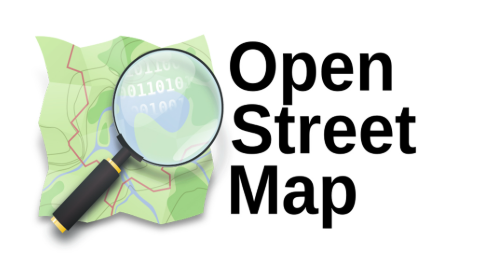

# 🗺️ Road Damage Visualization Web App
This web application visualizes road damage reports (e.g., potholes, cracks, garbage) on an interactive map using Leaflet.js. It uses a Flask backend and MongoDB Atlas to receive, store, and display real-time damage reports.

## 📂 Project Structure
- app.py: Main Flask application that:

  Receives damage data via POST request (/api/add).

  Stores the data in MongoDB Atlas.

  Retrieves data and renders it on the map using map.html.

- map.html: Frontend template using Leaflet.js that:

  Displays a styled interactive map centered on Cairo.

  Adds markers for each damage report.

  Uses Flask template rendering to inject marker data.

- request.py: A sample client script that:

  Sends test damage data (latitude, longitude, type) to the Flask backend via HTTP POST requests.

## 🛠️ How It Works
- request.py sends damage data to http://localhost:5000/api/add.

- Flask receives it at the /api/add endpoint and stores it in MongoDB Atlas.

- When the user opens /, Flask fetches all damage records and renders them on the Leaflet map as popup markers.

- Map uses CartoDB light tiles for a clean background.

## 🔧 Technologies Used
- Backend: Flask (Python), MongoDB Atlas (cloud database)

- Frontend: HTML, JavaScript, Leaflet.js (for maps)

- Testing Client: Python requests library

## 🌐 Deployment Notes
- The Flask app runs on port 5000 and is accessible via http://your_ip:5000/.

- Ensure your IP is whitelisted in MongoDB Atlas.

- For cloud hosting, run Flask with host='0.0.0.0' and use a public static IP.

## 🎥 helpfull youtube videos

[flask 1](https://youtu.be/Ze_lPWFQmXI?si=46FioDt0Q-AQt8i1)

[flask 2](https://youtu.be/07qgoQngK2Q?si=TSSNi-Frq_0fFoNR)