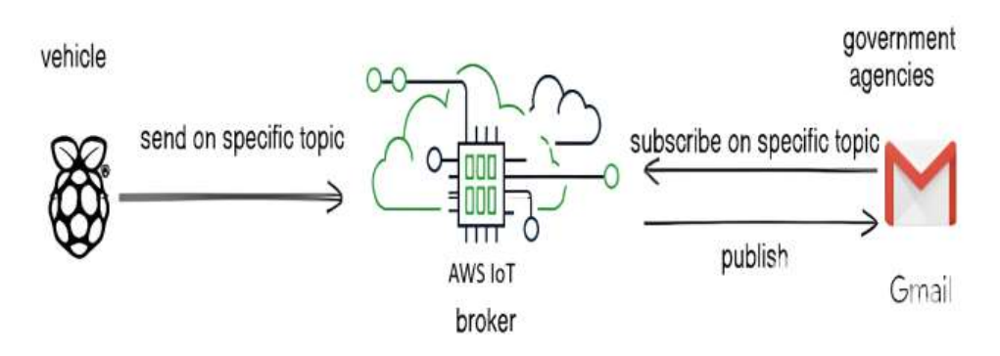

# 🚗 Vehicle-to-Cloud (V2C) — MQTT Publisher (C++)
This application runs on a Raspberry Pi and is responsible for securely sending road damage alerts (detected via AI) to AWS IoT Core using MQTT protocol over TLS.

## 🔧 Features:
- Reads AI detection result (ai.txt) and GPS coordinates (gps.txt).

- Publishes to the AWS IoT Core topic: road/damage.

- Uses TLS encryption with:

  - Root CA

  - Device certificate

  - Private key

- If AWS is unavailable (connection error), the message is backed up locally in unsent.txt and retried later.

  Also resends all previously failed messages (from unsent.txt) once connection is restored.

## 🔐 Secure Communication:
- MQTT over port 8883 (TLS).

- Device authenticated using X.509 certificates.

- QOS 1 ensures messages are delivered at least once, with retry on failure.

## 📁 File Paths:
- ai.txt: Road damage type (e.g., pothole, crack).

- gps.txt: Coordinates from GPS module.

- unsent.txt: Backup storage for unsent messages.

## 🎥 helpfull youtube videos and papers

[connecting to aws 1](https://youtu.be/sKp9Ew5chjA?si=OGvm3KA3k6b1_qTI)

[connecting to aws 2](https://youtu.be/E3LrmOY27bY?si=_JwJ3Lu5WsoqSA8v)

[MQTT](https://www.researchgate.net/publication/373640610_MQTT_Protocol_for_the_IoT_-_Review_Paper)
