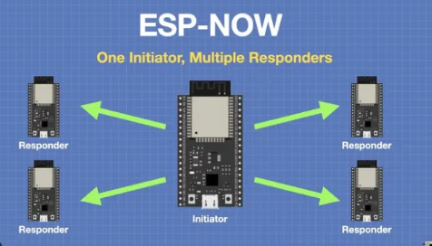

# V2V Communication Transmitter
This firmware runs on the main ESP32 device responsible for receiving damage alerts from the Raspberry Pi (via UART) and forwarding them to the other vehicle via ESP-NOW.

## 🔧 Functionality:
- Receives road damage alerts over UART from the Raspberry Pi.

- Extracts the object/damage description from the message.

- Displays the damage alert on a 16x2 LCD screen.

- Transmits the damage type using ESP-NOW broadcast to another ESP32 device (secondary vehicle).

- Acknowledges delivery status via UART back to the Raspberry Pi.

## 🧩 Technologies Used:
- UART communication via HardwareSerial.

- ESP-NOW wireless protocol (MAC broadcast).

- LCD interfacing using LiquidCrystal library.

## 🔄 Sample Message Flow:

Raspberry Pi (UART) --> ESP32 --> ESP-NOW --> Other ESP32

## 📍 Notes:
- Uses Serial2 (GPIO 25 = RX, 26 = TX) for UART.

- Broadcast MAC address is set to FF:FF:FF:FF:FF:FF (send to all peers).

- Message format from Pi should include a colon : to extract the object type.

## helpfull tutorial:
 [ESP32 connection via ESP-NOW](https://randomnerdtutorials.com/esp-now-two-way-communication-esp32/)
 
 [ESP32 connection via ESP-NOW](https://eprints.uklo.edu.mk/id/eprint/6312/1/Paper%20Slovenia%20-%202021%20Chalenges%20of%20the%20future%20-%20Roberto%20Ivo%20Kokan.pdf)