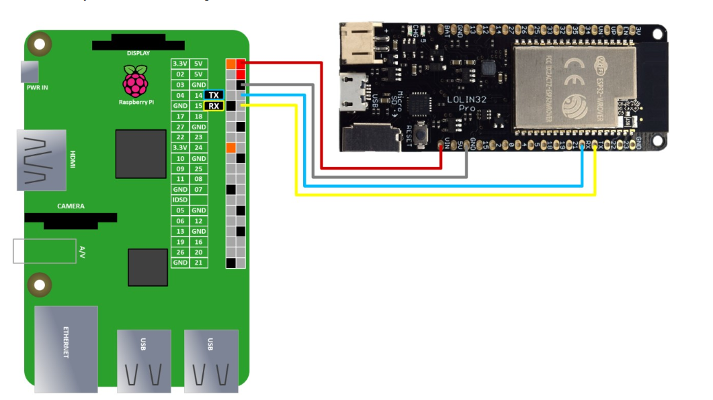

# 📡 V2V Transmission - UART to ESP32 (C++)
This application is responsible for sending road damage alerts from the Raspberry Pi to an ESP32 module over UART as part of the V2V (Vehicle-to-Vehicle) communication system.

## 🔧 Features:
- Reads AI detection message from ai.txt.

- If the file is not empty, it:

- Opens /dev/ttyAMA2 UART port.

- Sends the content of ai.txt to the ESP32 via UART.

- Prints the sent message to the terminal.

- If the file is empty, it prints an error message and exits.

📁 Input:
- ai.txt: Contains the detected road damage type (e.g., "pothole").

📤 Output:
- Sends the damage message over UART to the ESP32 which will then broadcast it using ESP-NOW.

## 📚 helpfull links
[Raspberrypi5 _uart_communication](https://www.electronicwings.com/raspberry-pi/raspberry-pi-uart-communication-using-python-and-c)
[Raspberrypi5 pins](https://github.com/Felipegalind0/RPI5.pinout)

