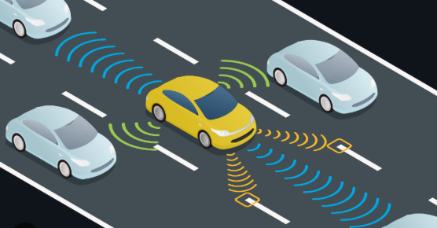

# 🚗 Vehicle-to-Vehicle (V2V) Communication System
This application enables direct communication between two vehicles using ESP32 modules and ESP-NOW protocol. It allows a car that detects road damage (via Raspberry Pi) to warn nearby vehicles in real time.

## 📡 V2V Architecture
### Main Vehicle (Transmitter)

- Reads AI detection results from a file (ai.txt) on Raspberry Pi.

- Sends alert message via UART to its connected ESP32.

- ESP32 formats and transmits the alert using ESP-NOW broadcast.

= Shows the alert on an LCD screen for driver visibility.

### Other Vehicle (Receiver)

- Listens for ESP-NOW messages from other ESP32s.

- Upon receiving an alert:

- Displays the message on an LCD screen.

- Sends a ‘stop’ signal ('S') to an Arduino via UART, simulating an emergency stop system.

## 💡 Features
- Real-time wireless communication between vehicles using ESP-NOW.

- Immediate warning display on LCD for the driver.

- Emergency stop trigger sent to Arduino when hazard is received.

- UART communication with Raspberry Pi and Arduino.

- No internet required — ESP-NOW works offline, ideal for safety-critical low-latency alerts.

## 🔐 Security & Reliability
- Uses ESP-NOW broadcast MAC (FF:FF:FF:FF:FF:FF) to reach all nearby vehicles.

- Supports multiple receivers (broadcast mode).

- Integration-tested with Raspberry Pi AI pipeline.